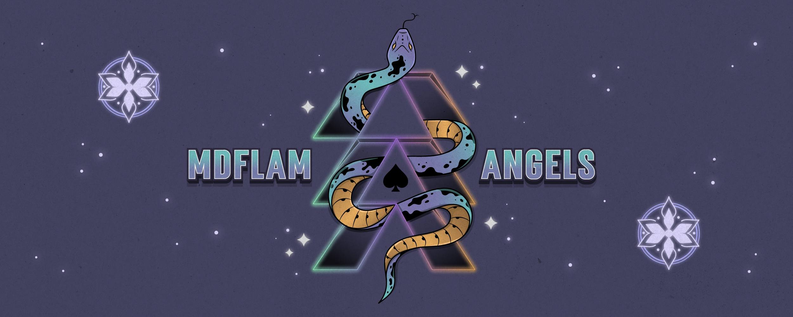

    <h1 style="margin: 20px auto; font-size: 36px; color: #a80fa3; font-family: Arial, sans-serif; font-weight: bold; text-shadow: 2px 2px 4px rgba(0,0,0,0.5); text-decoration: underline ; text-underline-offset: 8px;">MDFLAMorANGELS Profil's</h1>
    

 

Je viens de terminer ma reconversion professionnelle en tant que développeur web, ayant suivi une formation chez Openclassroom et une autre chez The Hacking Project.

Je me spécialise davantage dans le frontend, bien que je sois tout aussi à l'aise avec le backend. Ma polyvalence me permet d'être mobile dans mes compétences.

Actuellement à la recherche d'un poste en tant que développeur web, je consacre également une partie de mon temps libre à la réalisation d'applications personnelles.

Passionné par le monde de la tech, je suis constamment à l'affût des dernières innovations et tendances dans le domaine du développement web.
  

  

<h2 style="margin: 25px auto; font-size: 32px; color: #a80fa3; font-family: Arial, sans-serif; font-weight: bold; text-shadow: 2px 2px 4px rgba(0,0,0,0.5); text-decoration: underline ; text-underline-offset: 8px;">Contact</h2>
  
  
  

## Languages and Tools:

### Frontend

### Backend

### Tools

&nbsp;

  

